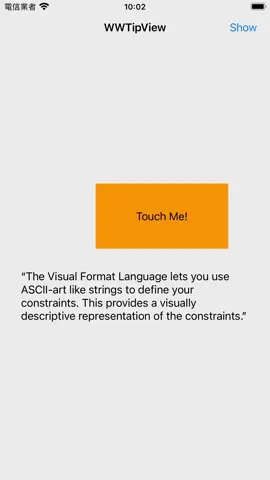

# WWTipView

[](https://developer.apple.com/swift/) [](https://developer.apple.com/swift/)  [](https://developer.apple.com/swift/) [](https://developer.apple.com/swift/)

## [Introduction - 簡介](https://swiftpackageindex.com/William-Weng)
- [Because TipKit can only be used on iOS 17.0 or above, a simple alternative was made.](https://developer.apple.com/documentation/tipkit)
- [因為TipKit只能在iOS 17.0以上才能使用,所以做了一個簡單的替代方案。](https://www.appcoda.com.tw/tipkit/)



### [Installation with Swift Package Manager](https://medium.com/彼得潘的-swift-ios-app-開發問題解答集/使用-spm-安裝第三方套件-xcode-11-新功能-2c4ffcf85b4b)
```
dependencies: [
    .package(url: "https://github.com/William-Weng/WWTipView.git", .upToNextMajor(from: "1.2.3"))
]
```

## Function - 可用函式
|函式|功能|
|-|-|
|display(target:at:direction:position:animation:textSetting:renderingMode:)|顯示提示框|
|display(targetView:at:direction:position:animation:textSetting:renderingMode:)|顯示提示框|
|dismiss(position:)|移除提示框|
|selectedColor(_:with:)|點選到項目所顯示的顏色|

## WWTipView.Delegate
|函式|功能|
|-|-|
|tipView(_:didTouchedIndex:)|被點擊到時的回應|
|tipView(_:status:)|動畫狀態|

## [Example](https://ezgif.com/video-to-webp)
```swift
import UIKit
import WWTipView

final class ViewController: UIViewController {
    
    @IBOutlet weak var label: UILabel!
    
    @IBAction func displayTipView(_ sender: UIButton) {
        
        let tipView = WWTipView()
        let textSetting: WWTipView.TextSetting = (textColor: .white, underLineColor: .clear, tintColor: .black, font: .systemFont(ofSize: 14.0), lines: 0)
        
        tipView.tag = 101
        tipView.delegate = self
        tipView.texts = ["Oh my God, I was pressed...", "Oh my God, I was pressed..."]
        tipView.edgeInsets = .init(top: 8, left: 56, bottom: 4, right: 20)
        tipView.display(target: self, at: sender, position: .center, animation: .move, textSetting: textSetting)
    }
    
    @IBAction func showTipView(_ sender: UIBarButtonItem) {
                
        let tipView = WWTipView()
        
        tipView.tag = 201
        tipView.delegate = self
        tipView.upperImage = UIImage(named: "flash")
        tipView.lowerImage = UIImage(named: "typhoon")
        tipView.text = "Intro to Swift Visual Formatting Language — The Good, The Bad, and The VFL"
        tipView.display(target: self, at: label, direction: .lower, position: .center, animation: .rotate, renderingMode: .alwaysOriginal)
    }
}

extension ViewController: WWTipView.Delegate {
    
    func tipView(_ tipView: WWTipView, didTouchedIndex index: Int) {
                
        if (tipView.tag == 201) {
            tipView.selectedColor(with: [index])
            tipView.dismiss(animation: .rotate)
        } else {
            tipView.selectedColor(.red, with: [index])
            tipView.dismiss(animation: .move)
        }
    }
    
    func tipView(_ tipView: WWTipView, status: WWTipView.AnimationStatusType) {
        print(status)
    }
}
```
